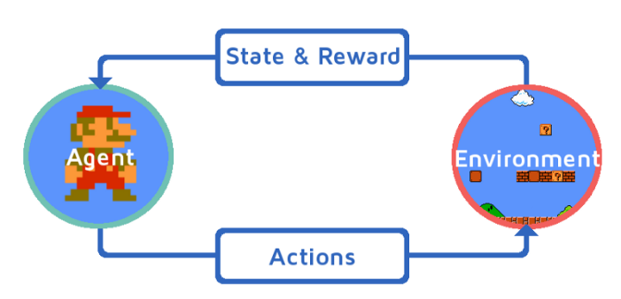

# rl-model
Code practice for reinforcement learning models



# Requirement

- python==3.7
- gym==0.19.0
- box2d
- gym_super_mario_bros==7.3.0

You can execute the following code to install gym-related packages.
```
pip install gym==0.19.0
conda install swig
pip install box2d-py
pip install gym_super_mario_bros==7.3.0
conda install ffmpeg -y
```

# gym version

Inconsistencies in code may occur due to gym version updates. For example,

- gym ≤ 0.25.2
```
next_state, reward, done, info = env.step(action)
```

- gym ≥ 0.26.0
```
next_state, reward, terminated, truncated, info = env.step(action)
done = terminated or truncated
```